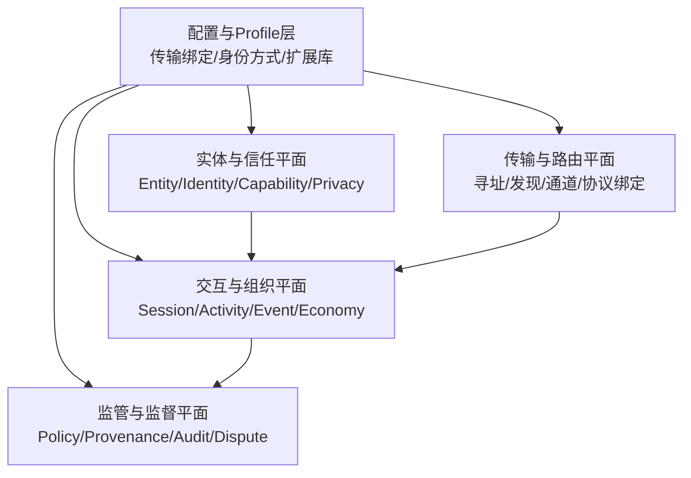
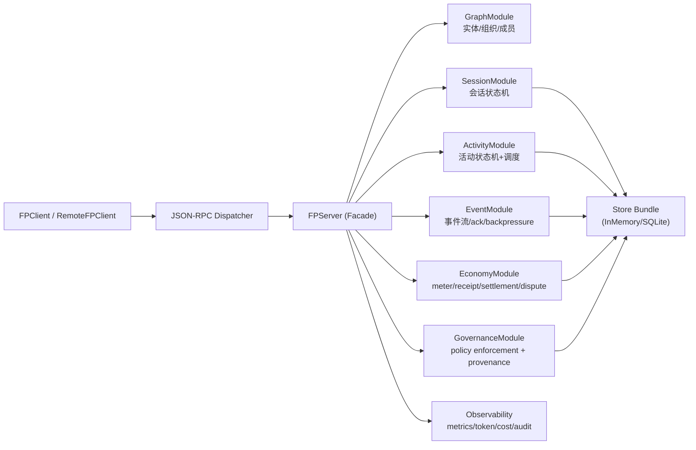
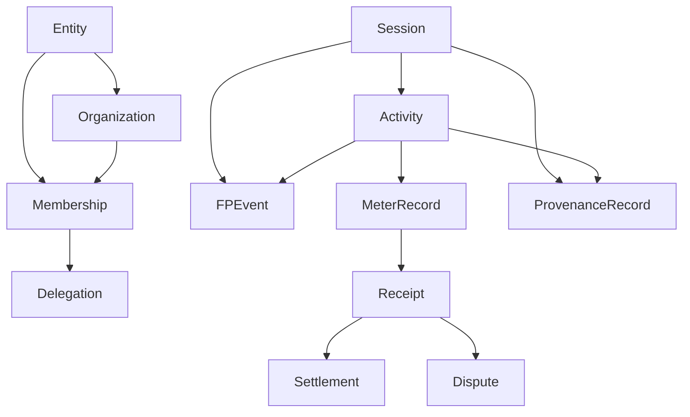
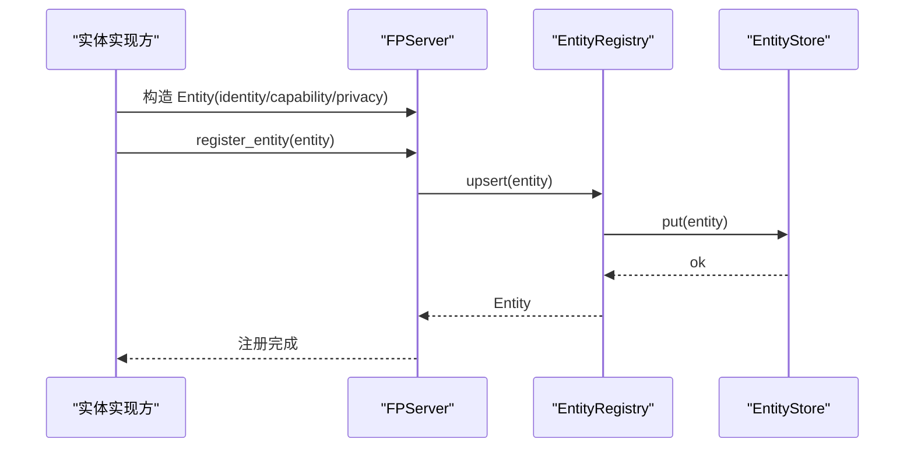
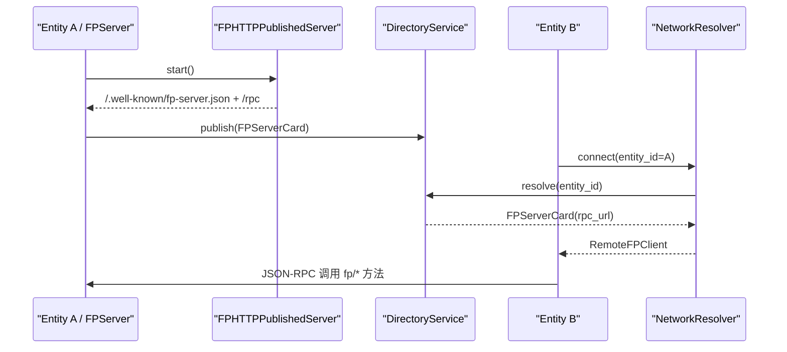
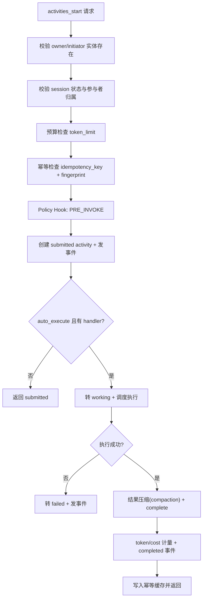
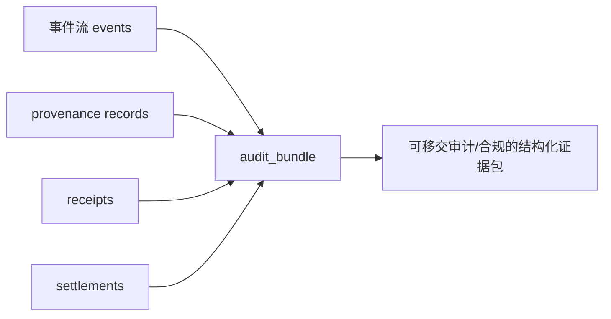
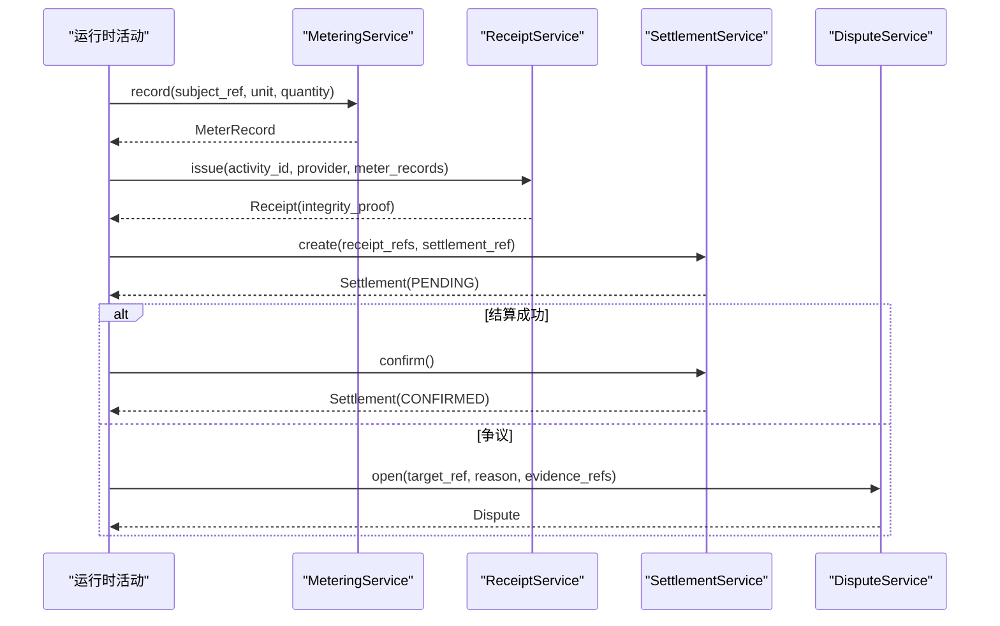
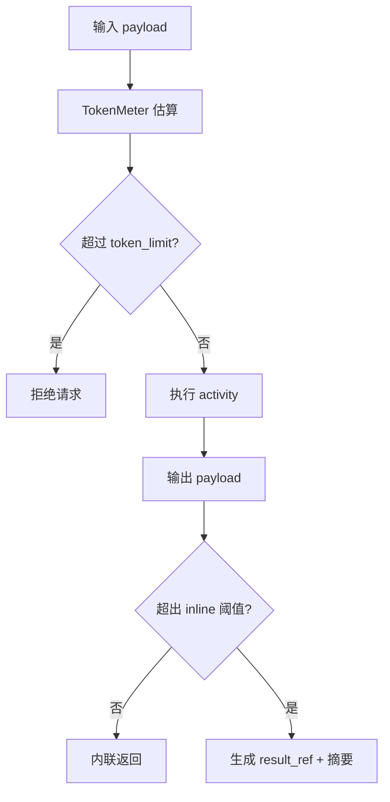

# FP 协议代码实现深度解析（中文）

> 目标读者：希望真正“读懂 FP 代码为何这样设计”的工程师、架构师、研究者。  
> 写作方式：像老师带学生一样，从问题出发，逐层映射到具体代码文件与执行流程。

---

## 0. 如何阅读这份文档

建议按下面顺序阅读：

1. 先看“第 1 章（白皮书目标 -> 代码映射）”，建立全局框架。
2. 再看“第 3 章（核心对象模型）”，理解 FP 的语义对象。
3. 然后看“第 4-8 章（五大核心能力）”，每章都包含流程图 + 代码落点。
4. 最后看“第 10 章（当前边界）”，避免把愿景误当成已实现能力。

---

## 1. 从 White Paper 到代码：FP 到底在解决什么

White Paper 的核心思想是：AI 系统从“单模型调用”走向“多实体社会化协作”后，真正的瓶颈不再是执行能力，而是：

- 谁在行动（身份与信任）
- 谁和谁在协作（组织与会话）
- 行动过程是否可控可复现（事件与状态机）
- 决策能否被解释和追责（policy/provenance）
- 价值交换能否被结算与争议处理（economy primitives）

FP 用“四平面 + 配置层”来组织这个问题。

### 1.1 白皮书四平面（概念）

### 1.2 代码中的对应关系（实现）

- 实体与信任：`src/fp/protocol/models.py` + `src/fp/graph/*`
- 传输与路由：`src/fp/transport/*` + `src/fp/federation/*`
- 交互与组织：`src/fp/runtime/*` + `src/fp/app/server.py`
- 监管与监督：`src/fp/policy/*` + `src/fp/runtime/modules/governance_module.py` + `src/fp/observability/audit_export.py`
- 配置与可替换件：`src/fp/profiles/*`, `src/fp/stores/*`, `src/fp/security/*`

---

## 2. 总体代码架构（运行时视角）

FP 的主入口是 `FPServer`（应用门面），但实际语义由 `RuntimeBundle` 组合的模块完成。

### 2.1 为什么要这样分层

- `app` 层：给业务方一个稳定 API 面（`FPServer/FPClient`）
- `runtime` 层：承载可测试的语义引擎（状态机、调度、事件）
- `protocol` 层：保证数据语义统一（对象定义与错误码）
- `stores/transport/federation/security`：可替换基础设施，不改变协议语义

这就是“核心语义稳定，基础设施可演进”的工程落地。

---

## 3. 协议核心对象模型（先把名词讲清楚）

FP 的对象不是“随便起的 DTO”，而是协议语义的承载体。

### 3.1 对象家族

- 主体对象：`Entity`, `Organization`, `Membership`, `Delegation`
- 交互对象：`Session`, `Activity`, `FPEvent`, `Envelope`
- 经济对象：`MeterRecord`, `Receipt`, `Settlement`, `Dispute`
- 监督对象：`ProvenanceRecord`

定义位置：`src/fp/protocol/models.py`

### 3.2 对象关系图

### 3.3 “协议约束”如何在代码中体现

模型 `__post_init__` 中有大量约束：

- `Entity`/`Activity`/`Session` 必填字段必须非空
- `Organization.entity.kind` 必须是 `organization`
- `Membership.roles` 不能为空
- `SessionBudget.token_limit` 不能为负

这使得非法状态在对象创建阶段就被拒绝，而不是在系统深处才崩。

---

## 4. 核心能力一：统一异质实体（Entity Unification）

这是 FP 的起点。没有统一实体，后面所有治理与经济都会散架。

### 4.1 支持哪些实体类型

`EntityKind` 当前内置 8 类（固定枚举）：

- `agent`
- `tool`
- `resource`
- `human`
- `organization`
- `institution`
- `service`
- `ui`

说明：这是“协议层固定语义集合”，不是无限任意字符串。

### 4.2 不同实体怎么接入

有三条路径：

1. 直接 API：`FPServer.register_entity(...)`
2. 快速封装：`fp.quickstart.Agent/ToolNode/ServiceNode/ResourceNode`
3. 适配器协议：实现 `FrameworkAdapter`（适合外部 agent framework）

### 4.3 接入流程（代码级）

相关代码：

- `src/fp/app/server.py` 中 `register_entity`
- `src/fp/graph/entities.py` 中 `EntityRegistry`
- `src/fp/protocol/models.py` 中 `Entity` 与 `Identity/CapabilitySummary/PrivacyControl`

### 4.4 与“只有 Agent Card”的差异（设计本质）

FP 把“实体语义”与“网络入口”分离：

- 实体语义：`Entity`（谁、能做什么、隐私所有权）
- 网络入口：`FPServerCard`（服务地址、签名、TTL）

好处：

- 一个实体可有不同部署入口（多环境）
- 实体治理（角色、policy、预算）不依赖某个发现卡格式
- 可将 human/org/institution 纳入同一语义层

---

## 5. 核心能力二：寻址、组网、群聊机制

FP 的“联网协作”不是单一 API 调用，而是“寻址 + 会话 + 事件流”的组合。

### 5.1 寻址组网（Federation）

#### 关键对象与模块

- `FPServerCard`：服务名片（`entity_id -> rpc_url`）
- `FPHTTPPublishedServer`：把本地 server 发布到 HTTP + well-known
- `DirectoryService`：目录（TTL/ACL/health/signature）
- `NetworkResolver`：按 `entity_id` 解析并连接

#### 流程图

### 5.2 “群聊”在 FP 里是什么

FP 不把群聊建模成“一个字符串 transcript”，而是：

- `Session`：群组容器（participants/roles/policy/budget）
- `Activity`：一次动作/任务
- `Event`：可回放、可 ack 的事件流

所以“群聊”本质是可治理的多实体会话。

### 5.3 事件流为何重要

`EventEngine` 支持：

- `stream`：创建流游标
- `read`：按 cursor 读取
- `resubscribe`：断线重连
- `ack`：消费确认
- `backpressure`：防止下游被淹没

这解决了“多人协作下消息可靠消费”问题。

---

## 6. 核心能力三：交互执行、权限与 Credential

这一章是 FP 的“执行主干”。

### 6.1 活动启动总流程（最关键）

`FPServer.activities_start` 实际委托给 `ActivityStartOrchestrator.start`。

### 6.2 权限控制在哪里做

当前实现是多层约束：

1. 会话参与者约束：owner/initiator 必须是 session participants
2. Policy 约束：`PRE_INVOKE`, `PRE_ROLE_CHANGE`, `PRE_SETTLE`
3. 目录 ACL：限制谁能 publish/read server card
4. HTTP 接入认证：`Authenticator`（静态 token 或 JWT）

### 6.3 Credential 支持现状

支持：

- Bearer token 抽取与认证（`StaticTokenAuthenticator`）
- JWT HS256（`JWTAuthenticator`）
- mTLS 上下文（`MTLSConfig` + SSL context helper）

注意：这是“协议运行时可用基础能力”，并非完整 IAM 平台。

### 6.4 装饰器式交互定义（DX）

`@operation` 可从函数签名构建 schema 与类型校验逻辑，再注入到调度器。

- 文件：`src/fp/app/decorators.py`
- 解析逻辑：`src/fp/app/schema_introspection.py`

这使“业务函数 -> 协议可调用 operation”变成低摩擦路径。

---

## 7. 核心能力四：安全、可靠性、审计

### 7.1 安全的第一层：状态机约束

- Session 有合法迁移表 `_ALLOWED_SESSION_TRANSITIONS`
- Activity 有合法迁移表 `_ALLOWED_TRANSITIONS`

这防止了常见错误：例如已完成任务再次取消、已关闭 session 再加入成员。

### 7.2 安全的第二层：幂等与冲突检测

`IdempotencyGuard` 用 `idempotency_key + fingerprint` 防重放与错重放：

- 同 key 同 payload：可重试返回同结果
- 同 key 不同 payload：抛 `CONFLICT`

这在网络重试下非常关键。

### 7.3 安全的第三层：传输可靠性

HTTP 客户端侧实现了生产级最小集：

- keep-alive 连接复用
- retry + exponential backoff + jitter
- circuit breaker

对应文件：

- `src/fp/transport/client_http_jsonrpc.py`
- `src/fp/transport/reliability.py`

### 7.4 审计链路（证据导出）

审计不是“打印日志”，而是导出结构化证据包：

- events
- provenance
- receipts
- settlements

`FPServer.audit_bundle` -> `export_audit_bundle`。

---

## 8. 核心能力五：AI Society Economy（最关键）

FP 的经济设计不是绑定某种币或链，而是定义“可验证交易语义骨架”。

### 8.1 经济闭环对象

1. `MeterRecord`：记录用量（subject/unit/quantity）
2. `Receipt`：对“提供了什么”做签名证明
3. `Settlement`：结算引用与状态
4. `Dispute`：争议目标与证据引用

### 8.2 经济执行流程

### 8.3 为什么这对 AI Society 必要

在 AI Society 中，“执行量”会迅速超过“人工可验证量”。

FP 通过统一的 meter/receipt/settlement/dispute 语义，把“价值交换是否可信”变成可编排协议流程，而不是散落在平台私有日志里。

### 8.4 Token 经济性与延迟控制

FP 当前实现的直接手段：

1. 输入预算门控：`SessionBudget.token_limit` 预估拦截
2. 输出压缩：`ContextCompactor` 大 payload 变 `result_ref`
3. 事件可控消费：ack + backpressure，降低下游过载

---

## 9. White Paper Section 3 场景如何落地到代码

| White Paper 场景 | FP 代码如何支持 |
| --- | --- |
| 3.1 跨协议日常协作（工具/代理/UI） | 用 `EntityKind` 表达异构实体；统一进入 `Session + Activity + Event`；JSON-RPC 统一入口 |
| 3.2 AI 组织运营 | `Organization + Membership + Delegation` + `PRE_ROLE_CHANGE` policy hook |
| 3.3 采购与持续服务关系 | `Receipt + Settlement + Dispute` 提供可验证履约与争议路径 |
| 3.4 代理服务市场与资源分配 | 用 session/activity 组织竞价或分配流程；用 meter/receipt 表达结果证据 |
| 3.5 开放社交网络与集体治理 | 组织角色 + policy/provenance 支持治理动作可追溯 |
| 3.6 强监管场景与 HITL | policy gate 可在敏感操作前拦截；审计包可对外核查 |

注意：FP 的强项是“把这些场景需要的共性控制面标准化”，而不是替代每个垂直业务协议的细节。

---

## 10. 当前实现边界（必须如实理解）

这部分非常重要，避免把“已经有代码”与“未来可扩展方向”混淆。

1. `SessionBudget.spend_limit` 已有数据模型，但当前核心强制执行主要是 `token_limit`。  
2. `ACLAuthorizer` 存在于 `security` 包，但尚未在 server 全路径强制接入。  
3. 异步路径已支持 `AsyncFPServer/AsyncDispatchEngine`，但不少底层 store/engine 仍以同步实现为主。  
4. 目录签名校验能力齐全，但部署时若 `require_signature=False`，默认可接受 unsigned card（这是部署策略，不是协议缺失）。

把这些点讲清楚，反而体现架构诚实和工程可控。

---

## 11. 工程保障：为什么这套实现可维护

### 11.1 测试分层

- `tests/unit`: 状态机、编解码、签名、可靠性、分页等单元能力
- `tests/conformance`: 协议一致性与契约约束
- `tests/integration`: 远程互通、目录 TTL/ACL、场景端到端
- `tests/perf`: 事件吞吐 smoke

### 11.2 质量门

统一质量入口：`scripts/quality_gate.sh`

包含：

- 全量测试
- 示例场景运行
- 编译检查
- 规范文件验证

---

## 12. 给新同学的学习路径（建议按这个顺序读代码）

1. 先读 `src/fp/protocol/models.py`（协议对象）
2. 再读 `src/fp/app/server.py`（门面 API）
3. 然后读 `src/fp/app/activity_orchestrator.py`（核心执行链）
4. 再读 `src/fp/runtime/session_engine.py` / `activity_engine.py` / `event_engine.py`
5. 接着读 `src/fp/federation/*` 与 `src/fp/transport/*`
6. 最后读 `src/fp/economy/*` 与 `src/fp/policy/*`

如果你按这个顺序读，几乎不会迷路。

---

## 13. 核心代码索引（速查）

### 协议对象

- `src/fp/protocol/models.py`
- `src/fp/protocol/errors.py`

### 应用门面

- `src/fp/app/server.py`
- `src/fp/app/client.py`
- `src/fp/app/async_server.py`

### 执行引擎

- `src/fp/app/activity_orchestrator.py`
- `src/fp/runtime/session_engine.py`
- `src/fp/runtime/activity_engine.py`
- `src/fp/runtime/event_engine.py`
- `src/fp/runtime/idempotency.py`
- `src/fp/runtime/context_compaction.py`

### 联邦组网

- `src/fp/transport/http_publish.py`
- `src/fp/federation/network.py`
- `src/fp/federation/directory_service.py`
- `src/fp/federation/card_signing.py`

### 安全治理

- `src/fp/security/auth.py`
- `src/fp/security/jwt_auth.py`
- `src/fp/security/mtls.py`
- `src/fp/runtime/modules/governance_module.py`
- `src/fp/policy/hooks.py`

### 经济系统

- `src/fp/economy/meter.py`
- `src/fp/economy/receipt.py`
- `src/fp/economy/settlement.py`
- `src/fp/economy/dispute.py`

### 审计与可观测性

- `src/fp/observability/token_meter.py`
- `src/fp/observability/cost_meter.py`
- `src/fp/observability/audit_export.py`

---

## 14. 一句话总结

FP 当前代码实现的核心价值，不是“又一个调用协议”，而是把 **实体、协作、治理、证据、结算** 放进同一条可执行、可验证、可演进的协议主干里；这正是 White Paper 所说的 AI Society 基础设施含义。
